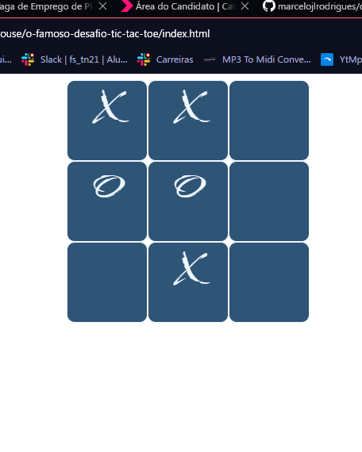

# Tic Tac Toe, mas se preferir jogo da velha

### Aqui como ficou a parte visual dela:

## Meu aprendizado:
- Manipulação da DOM
- Estilização com CSS (Importação de fontes, uso display flex)
- Lógica de programção para jogos
- Criatividade para resolver problemas

Obs.: Optei por não copiar projetos do mesmo tipo na internet, buscando primeiramente chegar a uma resolução apenas com o conhecimento que possuia, e com as minhas habilidades.